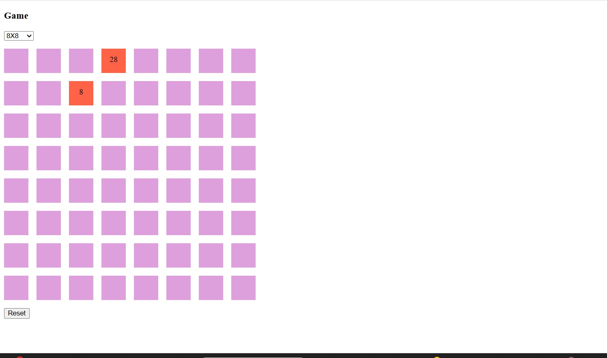
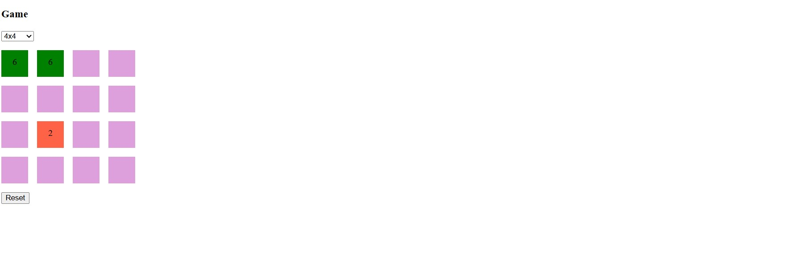
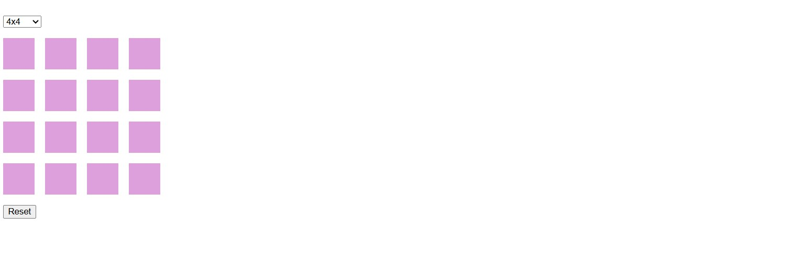
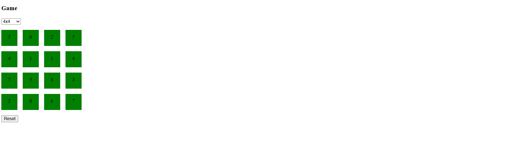

# AngularMemorygameRevamp

## About 
Angular project to practice complex state management (multi-dimensional array, objects) and angular latest features such as signal. 
 
Users are provided a board with initial size of 4x4. Users can choose a different board size using the dropdown. 
Cells are hidden when the game starts. Users can reveal cells by clicking on them. if 2 cells in a pair have matching values, they will turn green and become unclickable. Once all cells are green, game is over. 

## Screenshots

Image 1

Image 2

Image 3

Image 4

